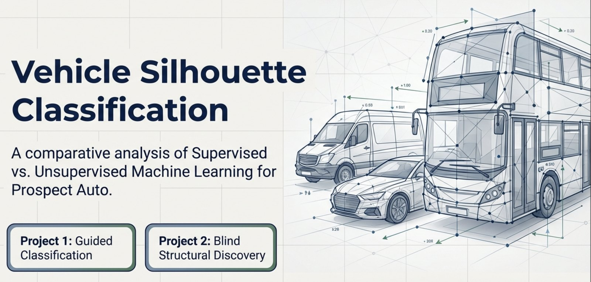
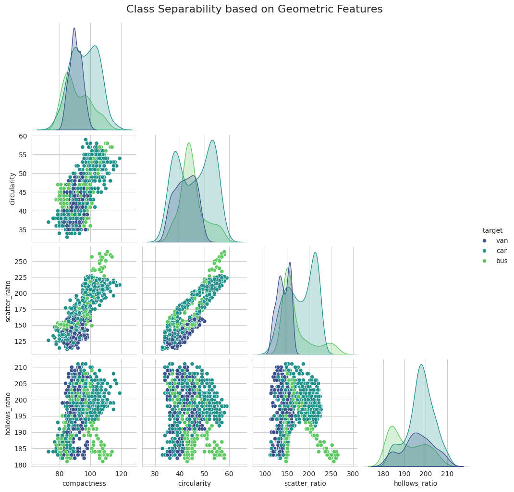
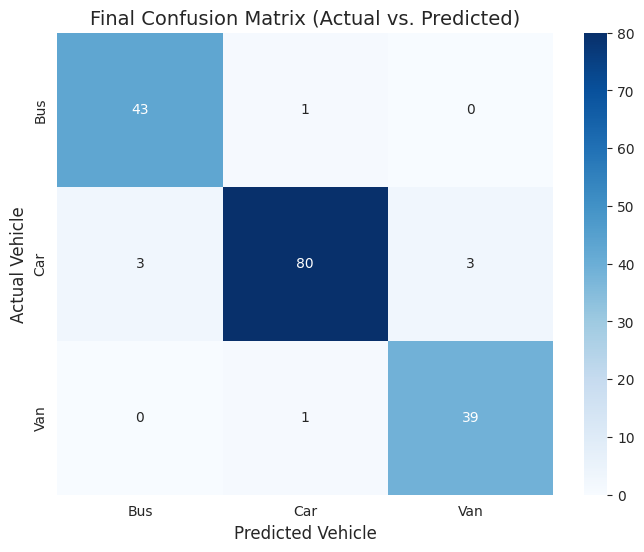
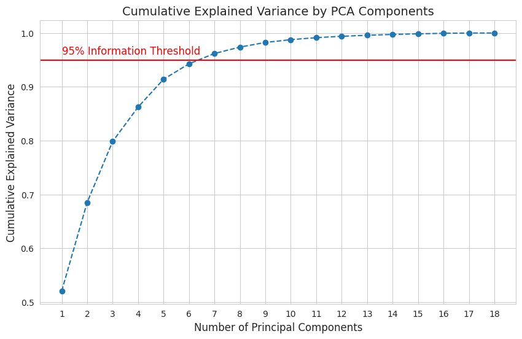
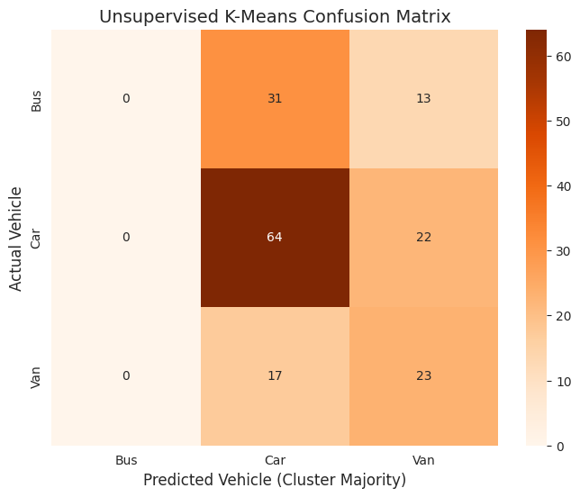

# Vehicle Silhouette Classification



Can a vehicle be identified from the geometry of its outline alone? This project answers
that twice: once with the answers available, and once without them.

Part 1 trains supervised models on labelled silhouettes and reaches 95.3% accuracy on
unseen data. Part 2 throws the labels away and asks whether clustering can recover the
same three vehicle types on its own. It cannot, and why it fails is the more interesting
half of the project.

## The problem

"Prospect Auto" wants to classify vehicles automatically from 18 numeric geometric
features extracted from silhouette images: compactness, circularity, radius ratio,
elongatedness, hollows ratio and similar shape descriptors. No pixels, no images at
inference time, just numbers describing a shape.

Three target classes: **bus**, **car** and **van**. Buses are geometrically distinct.
Cars and vans are not, and that overlap is the whole difficulty.

## Data

The UCI Statlog Vehicle Silhouettes dataset, 846 records and 19 columns, included in
this repository at `data/vehicle.csv` (55 KB).

| Class | Records | Share |
|---|---:|---:|
| car | 429 | 51% |
| bus | 218 | 26% |
| van | 199 | 24% |

There are no duplicate rows and a small number of scattered missing values, handled by
median imputation. The moderate class imbalance is the reason **macro F1** is the primary
metric throughout rather than accuracy: it refuses to let a model score well by
neglecting the two smaller classes.

## Reading the data before modelling



The pairplot set the expectation for everything that followed. `hollows_ratio` shows
three distinct peaks and separates buses almost by itself. In `scatter_ratio`, buses form
an isolated island. But cars and vans sit directly on top of each other in `compactness`
and `circularity`, with heavily mixed scatter.

The prediction from this: buses will be easy, cars and vans will be the friction, and
linear models will struggle where the boundary is not a straight line. Both halves of the
project were then tested against that prediction.

Five features correlating at |r| >= 0.95 with another feature were removed, reducing the
space from 18 columns to 13 without losing information. Two features correlating at 0.94
were deliberately kept: the variance they do not share is exactly the subtle geometry a
non-linear model needs to tell a van from a car.

## Preventing data leakage

Every transformation is fitted on the training set only and then applied to the test set.
This is stated explicitly because it is the difference between a real 95% and a flattering
one:

- **Split first.** An 80/20 stratified split preserves the 51/26/24 class ratio in both
  halves before anything else happens.
- **Imputation.** Median values are calculated from the training set alone.
- **Scaling.** The mean and standard deviation come from the training set alone.
- **PCA (Part 2).** The transformation matrix is learned from the training set alone.

The test set is not touched until final evaluation.

## Part 1: supervised classification

Three algorithms, evaluated with 5-fold stratified cross-validation on the training data:

| Model | CV accuracy | CV macro F1 |
|---|---:|---:|
| **Random Forest** | **0.948** | **0.945** |
| Logistic Regression | 0.936 | 0.932 |
| Support Vector Machine | 0.935 | 0.928 |

The linear baseline is already strong at 0.932, which says the classes are more separable
than the pairplot suggested. Random Forest wins, consistent with the expectation that
non-linear boundaries would help with cars and vans.

A grid search over 27 combinations returned `n_estimators=100`, `max_depth=None`,
`min_samples_split=2` at the same 0.945 macro F1, so the defaults were already close to
optimal and tuning added nothing. Worth stating rather than hiding.

### Final evaluation on the held-out test set

**95.29% accuracy**, macro F1 0.95, on 170 records the model had never seen.



| Class | Precision | Recall | F1 | Support |
|---|---:|---:|---:|---:|
| bus | 0.93 | 0.98 | 0.96 | 44 |
| car | 0.98 | 0.93 | 0.95 | 86 |
| van | 0.93 | 0.97 | 0.95 | 40 |

43 of 44 buses and 39 of 40 vans identified correctly. All six errors sit in the car
class, split evenly: three cars called buses, three called vans. That is exactly the
friction the pairplot predicted, and it is small.

## Part 2: unsupervised discovery

The labels are now discarded during training and retained only as an answer key for
scoring at the end. The question is whether the structure is strong enough for an
algorithm to find the three vehicle types unaided.

### Dimensionality reduction



Seven principal components capture 96.19% of the variance in the original 18 features.
The dataset compresses to roughly a third of its width with almost no information lost,
which confirms from a different direction what the correlation analysis showed: much of
this feature set is redundant.

### K-Means on the reduced space



**Adjusted Rand Index 0.084. Mapped accuracy 51.18%.**

Look at the bus column. It is empty. K-Means assigned nothing to a bus cluster, because
it never built one: asked for three clusters, it placed two of them inside the car region
and one on the vans. 31 buses were filed as cars and 13 as vans.

Two reasons, and they compound:

1. **Class imbalance.** Cars are 51% of the data. That density dominates the placement of
   centroids, and two of three landed in the same neighbourhood.
2. **Geometry.** K-Means measures Euclidean distance and assumes roughly spherical, equally
   sized clusters. The pairplot showed the real boundaries are neither.

The irony is that buses are the *easiest* class for the supervised model, at 98% recall.
An unsupervised method can fail completely on the very group that is most obviously
distinct, because the metric it optimises is not the question being asked.

## What the comparison shows

| | Macro F1 / ARI | Accuracy |
|---|---:|---:|
| Random Forest (supervised) | 0.95 | 95.3% |
| K-Means (unsupervised) | 0.084 ARI | 51.2% |

PCA earned its place: real compression, minimal loss, and a useful diagnosis of feature
redundancy. Clustering did not. For this problem the labels are not a convenience, they
are the thing that makes the task solvable, and a production system would need the
supervised model.

The general point is worth more than the specific result. Unsupervised methods are often
reached for when labelling is expensive, and this dataset shows why that instinct needs
testing rather than assuming: an algorithm optimising compactness in feature space is not
optimising for the categories a business cares about, and the two can come apart
completely.

## How to run

```bash
git clone https://github.com/pawel-gebicki/vehicle-silhouette-classification.git
cd vehicle-silhouette-classification
python3 -m venv .venv
source .venv/bin/activate          # Windows: .venv\Scripts\activate
pip install -r requirements.txt
jupyter lab notebooks/vehicle_silhouette_classification.ipynb
```

Run from the repository root so the relative path to `data/vehicle.csv` resolves.

**If you would rather just read it:** the notebook renders in full on GitHub with every
chart and result already in place. No installation and no data download required.

## Repository contents

```
vehicle-silhouette-classification/
├── data/
│   └── vehicle.csv                              846 records, 19 columns
├── images/                                      charts used in this README
├── notebooks/
│   └── vehicle_silhouette_classification.ipynb  the full analysis, both parts
├── requirements.txt
└── README.md
```

## Tools

Python (pandas, numpy, scikit-learn, matplotlib, seaborn), Jupyter.

---

## Author

**Pawel Gebicki**, Business Data Analyst. Power BI, SQL and Python, with ten years in
logistics and supply chain before the analytics.

Completed March 2026 as part of the MSIT Data Analytics programme, Berlin.

*Header image generated with NotebookLM. All charts in this README are output from the
notebook in this repository.*

[GitHub](https://github.com/pawel-gebicki) · [LinkedIn](https://linkedin.com/in/pawel-gebicki) · [Tableau Public](https://public.tableau.com/app/profile/pawel.gebicki)
